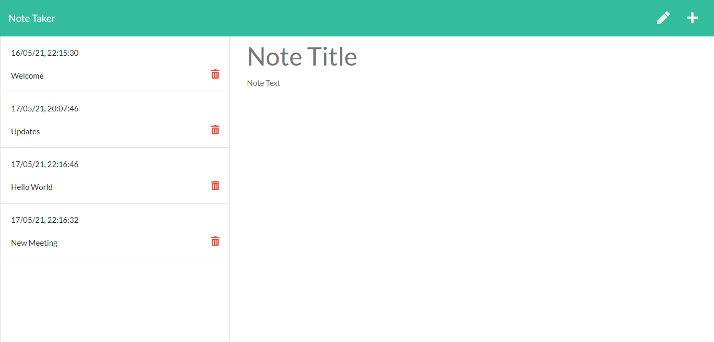
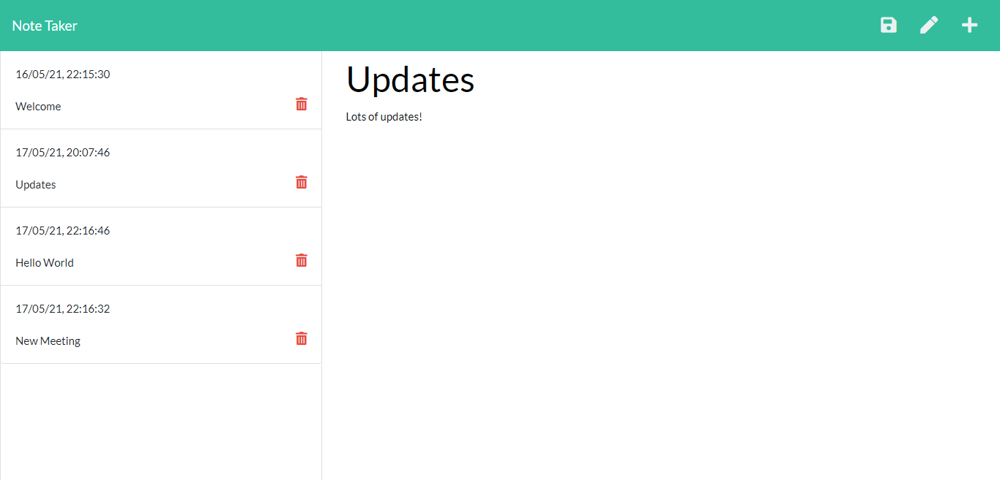

<h1>Note Taker</h1>

<h2> Table of Contents </h2>

- [About the Project](#about-the-project)
- [Getting Started](#getting-started)
  - [Installation](#installation)
  - [Launch the app](#launch-the-app)
- [Deployed App](#deployed-app)
- [Screenshots](#screenshots)
- [Questions](#questions)

## About the Project

This app was built using Node.js and Express.js for the back end, and can be used to write and save notes. The note data is currently saved and read from a JSON file.

## Getting Started

### Installation

```
git clone https://github.com/natasha-mann/note-taker-app.git
cd note-taker-app
npm i
```

### Launch the app

```
npm run start
```

## Deployed App

This app is currently deployed on Heroku. Please check it out [here](https://cryptic-basin-18355.herokuapp.com/)

## Screenshots




## Questions

If you have any questions about this application, please contact me by [email](mailto:natasha.s.mann@gmail.com).
